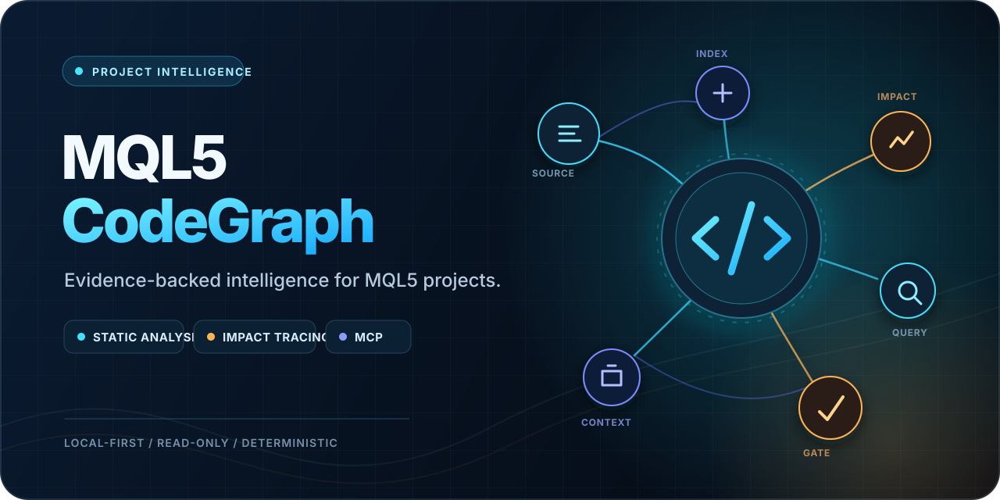

# MQL5 CodeGraph

<p align="center">
  
</p>

<p align="center">
  <a href="https://github.com/junet03/mql5-codegraph/actions/workflows/ci.yml"></a>
  
  <a href="LICENSE"></a>
  
</p>

MQL5 CodeGraph is an offline static-analysis library and CLI that builds an evidence-backed graph
from MetaTrader 5 `.mq5` and `.mqh` source. It treats terminal callbacks as runtime relationships,
keeps inferred edges separate from source calls, and stores a deterministic backend-neutral JSON index.

## MVP capabilities

- Tolerant tokenizer that ignores comments and string contents during structural analysis.
- Extraction of includes, classes, structs, enums, functions, methods, event handlers, and calls.
- Project and custom include-root resolution.
- MetaTrader runtime dispatch edges for standard event handlers.
- Deterministic JSON, query/context/impact commands, and GraphML export.
- A versioned Intelligence Kernel shared by direct Python, normalized CLI, and normalized HTTP callers.
- Evidence-ranked directed paths and deterministic bounded structural context packages.
- Partial results with diagnostics for incomplete or unresolved code.
- Analyzer-wide deterministic work budgets that stop excessive indexing without publishing a partial graph.
- An optional offline, page-aware corpus for user-owned MQL5 PDF references with deterministic cited search.

## Intelligence Kernel

`CodeGraph` is the backend-neutral canonical snapshot. `IntelligenceKernel` builds one immutable index
per snapshot and is the only authoritative interpreter for query, context, impact, diagnostics, directed
path, and context-package operations. CLI and Web remain thin projectors; GraphML and other
representation-only exporters may consume the canonical graph directly.

Normalized calls use contract `1.0.0`:

```powershell
mql5-codegraph intelligence query build/basic-ea.json CalculateLots --json
mql5-codegraph intelligence path build/basic-ea.json OnTick CalculateLots --json
mql5-codegraph intelligence context-package build/basic-ea.json CalculateLots --context-units 40 --json
```

The normalized HTTP equivalents are under `/api/v1/intelligence/*`. Existing unversioned CLI commands
and dashboard routes retain their frozen legacy shapes and defaults.

Relationship results preserve direction, type, origin, confidence, source location, and explicit evidence
state. Stored locations are references, not proof that a file is still present or unchanged.

## Local authoritative reference corpus

Install the optional builder, then transform your own local PDF copies outside the repository:

```powershell
python -m pip install "mql5-codegraph[reference]"
mql5-codegraph reference build D:\mql5-pdf --output D:\mql5-knowledge\reference-corpus --json
mql5-codegraph reference search D:\mql5-knowledge\reference-corpus OrderSend --json
```

The builder never downloads documents or invokes Graphify. It preserves source hashes, outline ancestry,
physical PDF pages, extraction limitations, and exact excerpt spans in immutable content-addressed
snapshots. The official language reference, general programming book, and specialist book receive
distinct authority tiers; unknown documents remain unclassified.

Keep PDFs and generated Markdown out of Git. They remain local derivatives subject to their source
documents' rights and terms. See the complete
[reference corpus guide](docs/reference-corpus.md), [v1 contract](specs/007-authoritative-reference-corpus/contracts/reference-corpus-v1.md),
and [ADR-0008](docs/decisions/ADR-0008-authoritative-reference-corpus.md).

An explicit external Graphify 0.9.x adapter can build a separate semantic overlay from normalized Markdown.
Local processing currently requires Ollama; remote providers require `--processing-boundary remote
--allow-remote`. Overlay inference is discovery evidence, never a normative document citation.

## Private Codex plugin (experimental)

The repository includes `mql5-codegraph-intelligence`, a private local Codex plugin with five MQL5
workflow skills and 13 read-only MCP tools. It projects the same Intelligence Kernel and reference-corpus
contracts and does not edit source, persist an index, build a corpus, invoke Graphify, or use the network.

```powershell
uvx --from build pyproject-build
python -m pip install "mcp>=1.28.1,<2"
python -m pip install --force-reinstall --no-deps (Resolve-Path .\dist\mql5_codegraph-*.whl)
codex plugin marketplace add D:\mql5-codegraph
codex plugin add mql5-codegraph-intelligence@mql5-codegraph-internal
```

The wheel install is intentionally non-editable so the MCP runtime does not import live code from this
source checkout. Start a fresh Codex task in the actual MQL5 project, not in this plugin repository. The
agent should call `project_status`, index an explicitly trusted project root when needed, and re-index
after source changes. For platform-document questions, it separately calls `reference_status`, attaches
only an operator-selected complete corpus, and preserves the corpus fingerprint in follow-up calls. The
plugin is an internal alpha, not a stable public MCP contract, and is not approved for hosted or
untrusted-repository ingestion.

The MCP entry point emits bounded JSON lifecycle records to stderr only. These distinguish startup,
clean stdio EOF, and unhandled server failure without exposing project roots or source. If Codex reports
`Transport closed`, restart the task/app transport and re-index; an in-memory snapshot cannot survive its
own server process.

## Analysis work limit

Every source analysis has a deterministic work budget covering discovery, lexing, parsing, resolution,
and runtime enrichment. The default is 1,000,000 units; use a value from 1 through 10,000,000 only for
an unusually large trusted local project. Exhaustion returns `analysis_budget_exceeded`, identifies the
phase and counters, and never writes/publishes a partial graph.

```powershell
mql5-codegraph analyze C:\work\Example-MQL5 --output build/example.codegraph.json --max-work 2000000 --json
```

MCP callers can supply the same optional `max_work` to `index_project`. A failed refresh keeps its prior
in-memory snapshot unchanged.

See the [plugin quickstart](specs/004-mql5-agent-plugin/quickstart.md) for the complete local workflow.

## Compiler evidence correlation

After an operator compiles a trusted local project, agents can correlate its explicitly supplied
MetaEditor log with the saved graph or active MCP snapshot. The report distinguishes `current`, `stale`,
and `incomplete` evidence, supports UTF-8 and BOM-marked UTF-16 logs, preserves supported compiler
findings, and links a finding to a symbol only when the file and declaration line match exactly. It never
launches MetaEditor, writes compiler artifacts, adds findings to the static graph, or treats compilation
as runtime proof.

```powershell
mql5-codegraph compiler-evidence build/example.codegraph.json --entry Experts\Example.mq5 --log compile.log --json
```

The documented English log grammar, size limit, failure codes, and MCP result are in the
[compiler-evidence contract](specs/006-compiler-correlation/contracts/compiler-evidence-v1.md).

## Local dashboard

Build the dashboard once, then launch it against any local MQL5 repository:

```powershell
cd web
npm ci
npm run build
cd ..
mql5-codegraph serve --root C:\work\Example-MQL5
```

The dashboard provides interactive graph navigation, symbol search, context and impact traversal,
diagnostic filtering, and safe source evidence. It is a loopback-only, unauthenticated local tool: non-loopback
binds are rejected, request authorities are validated, idle reads time out after two seconds, and every
request read has a ten-second absolute deadline. It does not upload source.

## Development

```powershell
python -m pip install -e ".[reference,mcp]"
python -m unittest discover -s tests -v
mql5-codegraph analyze tests/fixtures/basic_ea --output build/basic-ea.json
mql5-codegraph status build/basic-ea.json --json
```

See [architecture](docs/architecture.md), [known limitations](docs/limitations.md), and the
[dashboard guide](docs/web-dashboard.md). Contributors and tools are thanked in
[ACKNOWLEDGEMENTS.md](ACKNOWLEDGEMENTS.md). Multi-session work is recorded in the
[project journal](docs/project-journal/README.md), with durable choices tracked as
[architecture decisions](docs/decisions/README.md).

## License and trademarks

The source code and associated software documentation are available under the [MIT License](LICENSE).
The project visual identity and artwork are covered by [BRAND.md](BRAND.md).

MetaTrader 5 and MQL5 are trademarks of MetaQuotes Ltd. MQL5 CodeGraph is an independent project and is
not affiliated with, sponsored by, or endorsed by MetaQuotes Ltd.
