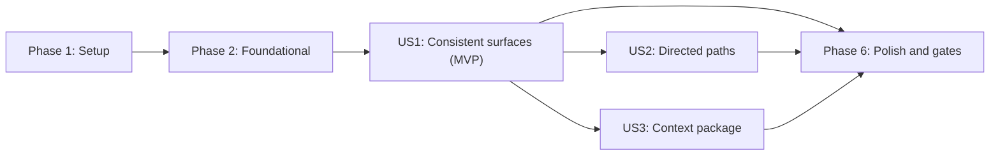

# Tasks: Versioned Intelligence Kernel

**Input**: Design documents from `specs/003-intelligence-kernel/`
**Prerequisites**: `plan.md`, `spec.md`, `research.md`, `data-model.md`, `contracts/`, `quickstart.md`

**Tests**: Required. The feature specification and project constitution require automated contract, conformance, regression, determinism, and performance checks. Each story starts with tests that must fail before implementation.

**Organization**: Tasks are ordered by dependency. After the foundational phase, each user story is independently testable. `[P]` means the task can run in parallel with adjacent tasks because it changes different files and has no unmet dependency. `[USn]` maps the task to a user story in `spec.md`.

## Phase 1: Setup (Shared Infrastructure)

**Purpose**: Establish package, test, and compatibility-fixture locations without changing runtime behavior.

- [X] T001 [P] Create the intelligence package boundary and module documentation in `src/mql5_codegraph/intelligence/__init__.py`
- [X] T002 [P] Create shared deterministic graph/request builders in `tests/intelligence/__init__.py` and `tests/intelligence/helpers.py`
- [X] T003 [P] Capture current CLI JSON/human output, stderr, exit codes, and HTTP payload/status behavior as immutable compatibility fixtures in `tests/fixtures/contracts/legacy_cli.json` and `tests/fixtures/contracts/legacy_http.json`

---

## Phase 2: Foundational (Blocking Prerequisites)

**Purpose**: Implement the versioned contract vocabulary, stable errors, immutable index, deterministic matching, and kernel shell required by every user story.

**Critical**: No user-story implementation starts until this phase passes.

- [X] T004 [P] Add failing serialization, schema-shape, version-validation, bounds-validation, and stable-error tests for FR-003, FR-004, FR-006, FR-012, and FR-015 in `tests/intelligence/test_models.py`
- [X] T005 [P] Add failing byte-for-byte legacy CLI compatibility tests for FR-014 in `tests/test_cli.py` using `tests/fixtures/contracts/legacy_cli.json`
- [X] T006 [P] Add failing byte-for-byte legacy HTTP compatibility tests for FR-014 in `tests/test_web_api.py` using `tests/fixtures/contracts/legacy_http.json`
- [X] T007 [P] Implement immutable v1 request, result, evidence, match, bound, completion, ambiguity, omission, and metadata models for FR-003, FR-004, FR-006, FR-008, FR-009, FR-010, and FR-012 in `src/mql5_codegraph/intelligence/models.py`
- [X] T008 [P] Implement stable machine-readable error codes and error serialization for FR-012 and FR-015 in `src/mql5_codegraph/intelligence/errors.py`
- [X] T009 Add failing deterministic `GraphIndex` construction, lookup, insertion-order independence, and read-only source-graph tests for FR-002, FR-009, and FR-013 in `tests/intelligence/test_matching.py`
- [X] T010 Implement immutable `GraphIndex` construction and lookup over `CodeGraph` for FR-001, FR-002, FR-009, and FR-013 in `src/mql5_codegraph/intelligence/index.py`
- [X] T011 Add failing exact, qualified, normalized, ambiguous, and not-found matching tests for FR-009 in `tests/intelligence/test_matching.py`
- [X] T012 Implement deterministic matching and explicit ambiguity preservation for FR-009 in `src/mql5_codegraph/intelligence/matching.py`
- [X] T013 Implement the version-negotiating `IntelligenceKernel` shell, request validation, snapshot identity, and stable dispatch errors for FR-001, FR-012, FR-013, and FR-015 in `src/mql5_codegraph/intelligence/kernel.py`
- [X] T014 Export only the supported v1 public surface from `src/mql5_codegraph/intelligence/__init__.py`

**Checkpoint**: Contract objects, errors, index, matching, and kernel construction are stable; legacy compatibility goldens exist and fail only where delegation is not yet implemented.

---

## Phase 3: User Story 1 - Consistent Intelligence Across Surfaces (Priority: P1) - MVP

**Goal**: Direct Python, legacy CLI/Web, normalized CLI, and normalized HTTP callers receive semantically equivalent query, context, impact, and diagnostic results from one authoritative kernel.

**Independent Test**: Build one graph snapshot, invoke the same operation directly, through CLI, and through HTTP, then compare normalized contract fields while asserting legacy fixture output is unchanged.

### Tests for User Story 1

- [X] T015 [P] [US1] Add failing bounded context and impact traversal tests covering direction, relationship type, evidence, cycles, truncation, and no-result completion for FR-003, FR-004, FR-005, FR-006, and FR-007 in `tests/intelligence/test_traversal.py`
- [X] T016 [P] [US1] Add failing direct/CLI/HTTP conformance vectors for query, context, impact, and diagnostics covering empty graphs, missing optional graph metadata, locationless/stale/unavailable/unknown evidence states, query/diagnostics `max_items` completion and truncation, and source-graph immutability for FR-002, FR-003, FR-004, FR-005, FR-006, FR-007, FR-013, FR-014, and FR-015 in `tests/intelligence/test_conformance.py`
- [X] T017 [P] [US1] Add failing atomic graph/kernel snapshot and reload consistency tests for FR-002 and FR-013 in `tests/test_web_state.py`

### Implementation for User Story 1

- [X] T018 [US1] Implement deterministic bounded neighborhood and impact traversal with typed directed evidence and explicit completion state for FR-003, FR-004, FR-005, FR-006, and FR-007 in `src/mql5_codegraph/intelligence/traversal.py`
- [X] T019 [US1] Implement kernel query, context, impact, and diagnostic operations over one immutable snapshot for FR-001, FR-002, FR-003, FR-004, and FR-013 in `src/mql5_codegraph/intelligence/kernel.py`
- [X] T020 [US1] Delegate compatible `CodeGraph` intelligence helpers to the kernel while preserving exporter access for FR-001, FR-014, and FR-016 in `src/mql5_codegraph/graph.py`
- [X] T021 [P] [US1] Add exact legacy projectors and the `intelligence query|context|impact|diagnostics --contract-version 1 --json` namespace for FR-002, FR-012, FR-014, and FR-015 in `src/mql5_codegraph/cli.py`
- [X] T022 [P] [US1] Store and atomically swap paired `CodeGraph` and `IntelligenceKernel` snapshots for FR-002 and FR-013 in `src/mql5_codegraph/web/state.py`
- [X] T023 [US1] Project legacy responses exactly and implement v1 query, context, impact, and diagnostics handlers for FR-002, FR-012, FR-014, and FR-015 in `src/mql5_codegraph/web/api.py`
- [X] T024 [US1] Register normalized v1 intelligence routes without changing legacy route behavior for FR-002, FR-012, FR-014, and FR-015 in `src/mql5_codegraph/web/server.py`
- [X] T025 [US1] Complete legacy and normalized projector conformance assertions, including stable ordering and exact fixture comparison for SC-001, SC-002, SC-003, and SC-006 in `tests/intelligence/test_conformance.py`, `tests/test_cli.py`, and `tests/test_web_api.py`
- [X] T026 [US1] Run the independent US1 acceptance slice and record observed evidence-state support, explicit limitations, and verification outcomes in `specs/003-intelligence-kernel/quickstart.md`

**Checkpoint**: US1 is independently usable as the MVP; all surfaces share semantics and legacy outputs remain exact.

---

## Phase 4: User Story 2 - Evidence-Backed Directed Path Tracing (Priority: P2)

**Goal**: Return deterministic bounded directed paths whose every hop carries type, direction, origin, confidence, and source location, while distinguishing no path from incomplete search.

**Independent Test**: Trace a known `OnTick` to `CalculateLots` route, verify every hop against source evidence, then test a disconnected graph, a cycle, equal alternatives, and an exhausted bound.

### Tests for User Story 2

- [X] T027 [US2] Add failing path tests for directed evidence; extracted/resolved/runtime/inferred origin; locationless, stale, unavailable, and unknown evidence states; confidence; source location; cycles; disconnected nodes; equal alternatives; deterministic ranking; and no-path versus bounded-incomplete semantics for FR-003, FR-004, FR-005, FR-006, FR-007, FR-008, FR-009, SC-002, and SC-007 in `tests/intelligence/test_paths.py`

### Implementation for User Story 2

- [X] T028 [US2] Implement evidence-first bounded path search, deterministic alternative ranking, cycle safety, unresolved-relationship visibility, and no-path versus bounded-incomplete completion reporting for FR-003, FR-004, FR-005, FR-006, FR-007, FR-008, and FR-009 in `src/mql5_codegraph/intelligence/paths.py`
- [X] T029 [US2] Add versioned path request dispatch and result serialization for FR-001, FR-012, and FR-015 in `src/mql5_codegraph/intelligence/kernel.py`
- [X] T030 [P] [US2] Add normalized v1 CLI path input, output, validation, and stable errors for FR-002, FR-012, and FR-015 in `src/mql5_codegraph/cli.py`
- [X] T031 [P] [US2] Add normalized v1 HTTP path projection, validation, and stable errors for FR-002, FR-012, and FR-015 in `src/mql5_codegraph/web/api.py`
- [X] T032 [US2] Register the normalized v1 path route without altering legacy routes for FR-002 and FR-014 in `src/mql5_codegraph/web/server.py`
- [X] T033 [US2] Run the independent US2 acceptance slice and preserve its executable assertions in `tests/intelligence/test_paths.py`

**Checkpoint**: US1 and US2 both pass independently; path results never imply runtime certainty without matching evidence origin.

---

## Phase 5: User Story 3 - Deterministic Bounded AI Context Package (Priority: P3)

**Goal**: Produce a deterministic context package that stays within budget, preserves atomic structural records, exposes ambiguity, and explains omissions.

**Independent Test**: Request a package with budget 40 twice through direct, CLI, and HTTP surfaces; assert identical ordering, size at or below budget, no partial structural record, and explicit omissions.

### Tests for User Story 3

- [X] T034 [US3] Add failing context-package tests for deterministic ranking, `structural_record_v1` accounting, atomic groups, ambiguity, locationless/stale/unavailable/unknown evidence states, omissions, tiny budgets, and cross-surface equivalence for FR-004, FR-005, FR-006, FR-009, FR-010, FR-011, SC-002, and SC-004 in `tests/intelligence/test_context.py`

### Implementation for User Story 3

- [X] T035 [US3] Implement deterministic context candidate ranking, evidence-state preservation, atomic structural groups, budget accounting, ambiguity, and omission reasons for FR-004, FR-005, FR-006, FR-009, FR-010, and FR-011 in `src/mql5_codegraph/intelligence/context.py`
- [X] T036 [US3] Add versioned context-package request dispatch and serialization for FR-001, FR-012, and FR-015 in `src/mql5_codegraph/intelligence/kernel.py`
- [X] T037 [P] [US3] Add normalized v1 CLI context-package input, output, validation, and stable errors for FR-002, FR-012, and FR-015 in `src/mql5_codegraph/cli.py`
- [X] T038 [P] [US3] Add normalized v1 HTTP context-package projection, validation, and stable errors for FR-002, FR-012, and FR-015 in `src/mql5_codegraph/web/api.py`
- [X] T039 [US3] Register the normalized v1 context-package route without altering legacy routes for FR-002 and FR-014 in `src/mql5_codegraph/web/server.py`
- [X] T040 [US3] Run the independent US3 acceptance slice and preserve its executable cross-surface assertions in `tests/intelligence/test_context.py`

**Checkpoint**: All three user stories are independently functional and conform to contract v1.

---

## Phase 6: Polish & Cross-Cutting Concerns

**Purpose**: Prove determinism, compatibility, regression safety, and the performance envelope; document observed behavior and refresh project intelligence.

- [X] T041 Add 100-repeat and randomized insertion-order determinism checks for every normalized operation and SC-003 in `tests/intelligence/test_conformance.py`
- [X] T042 Implement the opt-in 10k-node index, query, path, and context benchmark with machine-readable timing output for SC-005 in `tools/benchmark_intelligence.py`
- [X] T043 Add a reduced benchmark correctness smoke test that never enforces wall-clock timing in default CI for SC-005 in `tests/intelligence/test_conformance.py`
- [X] T044 [P] Document the authoritative boundary, adapter matrix, versioning, evidence semantics, and exporter exception for FR-001, FR-002, FR-003, FR-012, and FR-016 in `README.md` and `docs/architecture.md`
- [X] T045 [P] Document current static-analysis limitations and non-runtime evidence guarantees for FR-004, FR-005, and FR-016 in `docs/limitations.md`
- [X] T046 Run the reference-fixture end-to-end flow plus all intelligence, CLI, Web, exporter, full regression, and `compileall` checks for SC-006, then record exact verified commands and outcomes in `specs/003-intelligence-kernel/quickstart.md`
- [X] T047 Run the opt-in 10k-node benchmark, record machine identity, Python version, commands, raw timings, thresholds, and pass/fail interpretation for SC-005 in `docs/project-journal/2026-07-22-005-intelligence-kernel-implementation.md`
- [X] T048 Run incremental Graphify indexing and health checks after implementation without staging generated `graphify-out/` artifacts, then record affected concepts, graph health, verification evidence, and remaining risks in `docs/project-journal/2026-07-22-005-intelligence-kernel-implementation.md` and `docs/project-journal/README.md`

---

## Dependencies & Execution Order

### Phase Dependencies



- Phase 1 has no dependencies.
- Phase 2 depends on Phase 1 and blocks every user story.
- US1 depends on Phase 2 and establishes the shared CLI/HTTP adapter entry points. US2 and US3 both depend on US1, but do not depend on each other and may proceed in parallel after the US1 checkpoint.
- Phase 6 depends on all selected user stories; the release gate requires all three.

### User Story Dependencies

- **US1 (P1)**: Depends only on the foundational contract/index/kernel shell. It establishes shared adapter infrastructure and is the MVP.
- **US2 (P2)**: Depends on US1 because its CLI/API/server tasks extend the normalized adapter entry points established there; it otherwise owns path behavior independently.
- **US3 (P3)**: Depends on US1 because its CLI/API/server tasks extend the normalized adapter entry points established there; it otherwise owns context-package behavior independently.

### Within Each User Story

1. Add failing tests and confirm failure is caused by missing behavior.
2. Implement the pure kernel operation.
3. Expose it through the versioned kernel facade.
4. Add CLI and HTTP projectors/routes.
5. Run the story's independent acceptance slice.

### Parallel Opportunities

- T001, T002, and T003 can run in parallel.
- T004, T005, and T006 can run in parallel; T007 and T008 can then run in parallel.
- T015, T016, and T017 can run in parallel.
- After T019, T021 and T022 can run in parallel.
- After the US1 checkpoint and T029, T030 and T031 can run in parallel.
- After the US1 checkpoint and T036, T037 and T038 can run in parallel.
- T044 and T045 can run in parallel after behavior is stable.

---

## Parallel Example: User Story 2

```text
Task: T030 [US2] Add normalized v1 CLI path handling in src/mql5_codegraph/cli.py
Task: T031 [US2] Add normalized v1 HTTP path handling in src/mql5_codegraph/web/api.py
```

## Parallel Example: User Story 3

```text
Task: T037 [US3] Add normalized v1 CLI context-package handling in src/mql5_codegraph/cli.py
Task: T038 [US3] Add normalized v1 HTTP context-package handling in src/mql5_codegraph/web/api.py
```

---

## Implementation Strategy

### MVP First

1. Complete Phase 1.
2. Complete and verify Phase 2.
3. Complete US1 and stop at its checkpoint.
4. Demonstrate direct/CLI/HTTP equivalence and exact legacy compatibility before adding paths or context packaging.

### Incremental Delivery

1. Foundation: versioned models, errors, immutable index, deterministic matching, kernel shell.
2. US1: common intelligence semantics and adapter compatibility.
3. US2: evidence-backed directed path tracing.
4. US3: bounded deterministic AI context packaging.
5. Cross-cutting gates: determinism, regression, exporter compatibility, benchmark, documentation, Graphify/project journal.

### Completion Rule

A task is complete only when its specified files are changed, its focused tests pass, no legacy golden changes are accepted without explicit review, and any new behavior is reflected in the contract or documentation named by that task.
